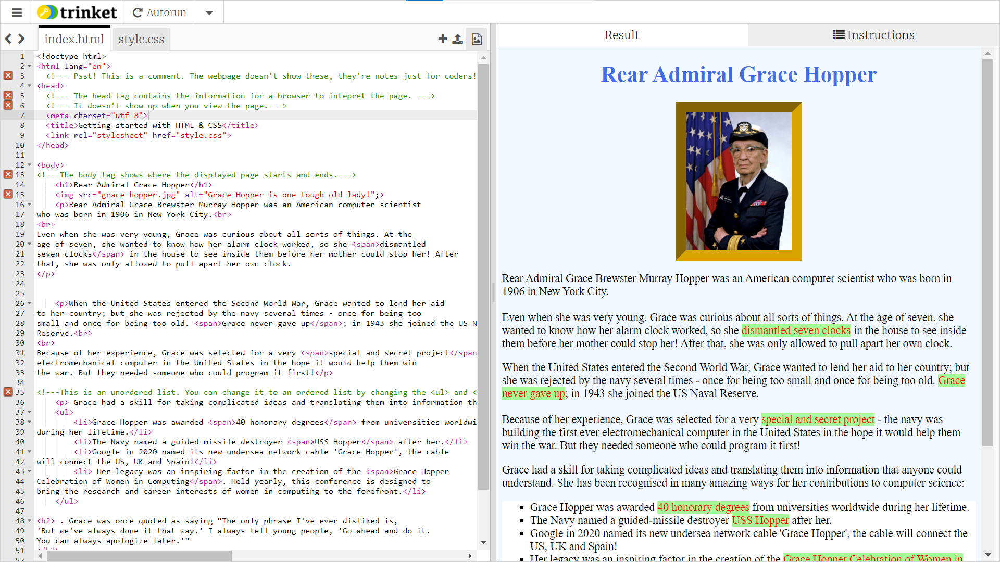

## Introduction

Create a cool, interesting website to share information about a famous Computer Scientist!

### What you will make

--- no-print ---
Embedded here is an example of a finished website:

<iframe src="https://trinket.io/embed/html/76a29f9386?outputOnly=true" width="100%" height="600" frameborder="0" marginwidth="0" marginheight="0" allowfullscreen></iframe>

--- /no-print ---

--- print-only ---

--- /print-only ---

--- collapse ---
---
title: What you will need
---
### Hardware

+ A computer or tablet

### Software

+ This project can be completed in a web browser using [trinket.io](https://trinket.io/) or [repl.it](https://replit.com/)
+ You can also use an offline code editor like [Visual Studio Code](https://code.visualstudio.com/Download)

### Downloads

+ Download the project [starter file](http://rpf.io/p/en/edit-the-web-go){:target="_blank"} if working offline

--- /collapse ---

--- collapse ---
---
title: What you will learn
---
+ Make a website about a famous Computer Scientist.
+ Use HTML elements and tags to structure your website
+ Add CSS rules to make a boring website colourful and interesting

--- /collapse ---

--- collapse ---
---
title: Additional information for educators
---

You can download the completed project [here](http://rpf.io/p/en/edit-the-web-get){:target="_blank"}.

If you need to print this project, please use the [printer-friendly version](https://projects.raspberrypi.org/en/projects/edit-the-web/print){:target="_blank"}.

--- /collapse ---

HTML & CSS are languages used to create websites, they helped make this page! HTML elements and tags are the building blocks to structure the website. CSS rules are used to style how the website looks.

Get inspiration: [Rear Admiral Grace Hopper!]()

+ What do you like about the layout?
+ What would you change? 
+ Are colours important, would a black and white site be as eye-catching?

A Web designer is someone who plans, designs and creates websites. There are hundreds of millions of active websites so using HTML & CSS helps their websites stand out.
