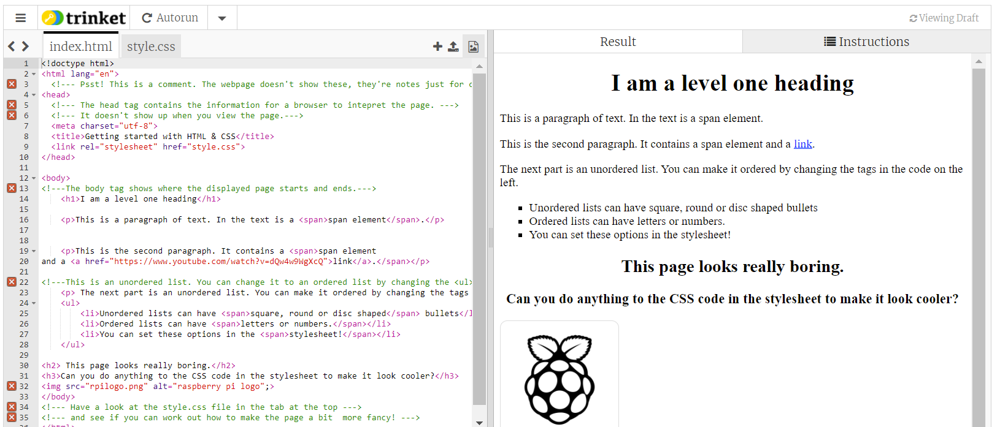

## Make a website your own with HTML

In this project you're going to take a webpage that looks really boring and contains no interesting information, then change the HTML and CSS to make it way cooler. 

Before we start, pick a notable figure from computer science history you'll create your site about. 

We have provided some information on a few people here, or you are welcome to research another person who inspires you:
+ [Ajay Bhatt](https://en.wikipedia.org/wiki/Ajay_Bhatt) - Inventor of the USB standard (India)
+ [Alan Emtage](https://en.wikipedia.org/wiki/Alan_Emtage) - Inventor of internet search (Barbados)
+ [Radia Perlman](https://en.wikipedia.org/wiki/Radia_Perlman) - a.k.a. the 'Mother of the Internet', invented STP networking (USA)
+ [Grace Hopper](https://en.wikipedia.org/wiki/Grace_Hopper) - Inventor of the compiler, US Navy programmer since WWII (USA)
+ [Katherine Johnson](https://en.wikipedia.org/wiki/Katherine_Johnson) - NASA Mathematician and programmer, subject of the film *Hidden Figures*. (USA)

--- task ---

If working **online**, open the [starter project](https://trinket.io/library/trinkets/609451ca1d){:target="_blank"} in Trinket.
 
If working **offline**, open the project [starter file](http://rpf.io/p/en/edit-the-web-get){:target="_blank"} in an offline text editor or coding IDE. 

You should see...
 


--- /task ---

The two main languages used to create websites are HTML (which stands for **H**yper**T**ext **M**arkup **L**anguage) and CSS (**C**ascading **S**tyle **S**heets). In this project, we're going to look at what both of them do and how they work together to make interesting websites.

You'll notice that in the code window, there are lots of angular brackets: <> These denote the different **elements** that make up a website. 

HTML elements are made up of a **start tag**, some content you want to display and an **end tag**.

--- task ---

Take a look now at the code in the website **header** and see if you can identify the following elements:

+ The ```<!DOCTYPE html>``` declaration defines that this document is an HTML5 document
+ The ```<html>``` element is the root element of an HTML page, and ends at the end of the page with ```</html>```
+ The```<head>``` element contains meta information about the HTML page and ends at the ```</head>``` end tag
+ The ```<title>``` element specifies a title for the HTML page (which is shown in the browser's title bar or in the page's tab) and ends with the ```</title>``` end tag

--- /task ---

If you take a close look, you'll notice that the information contained within the ```<head>``` element isn't displayed on the page. It is mostly filled with information for your browser, to give it specific instructions on how to understand your code. 

We will include this information in every website we make. In this project, we'll only be looking at the **Title** from the information in the site header.

--- task ---
Change the title of your website now by editing the text between the two ```<title>``` tags.

You *could* write anything you want here, but we suggest you make it something about your chosen figure, so the browser tab shows what the page is about.
--- /task ---

### Website Body
Inside the ```<body>``` element under the header, we put all the other elements we want to be displayed. 

+ The ```<body>``` element defines the document's body, and is a container for all the visible contents, such as headings, paragraphs, images, hyperlinks, tables, lists, etc. and ends at the ```</body>``` tag.
+ The ```<h1>``` element defines a large heading, with higher numbers making smaller sized headings, all the way down to ```<h6>```. It ends in a ```</h1>``` tag.
+ The ```<p>``` element defines a paragraph - what end tag do you think it has?

--- task ---
Change the **heading** of your site to be indicative of the information you're about to include. 

It might be the name if the figure you've chosen, or something more exciting about them that would draw your reader in.
--- /task ---

The main body of your website will be in paragraph text marked by ```<p>``` and ```</p>``` tags. 

In the main body of your website, you can see some text in the paragraph is grey.

If there is text within your paragraph that you would like to style differently, you can set some ```<span>``` tags around it and then change the CSS. 

--- task ---
Create a first paragraph introducing your inspiring figure, using ```<span>``` tags to highlight important information. 

Leave it ```DarkGray``` for now, we'll change the colour in the next step.
--- /task ---

### Lists 

Lists allow developers to group related information together. Lists can be unordered (like bullet points) or ordered (sequenced with numbers or letters). 


--- task ---

--- /task ---


--- task ---

--- /task ---


--- task ---

--- /task ---


--- save ---