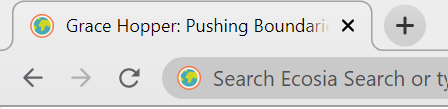

## Choose a Figure

In this project you're going to take a webpage that looks really boring and contains no interesting information, then change the HTML and CSS to make it way cooler. 

A website needs a purpose; your website will share information about a famous Computer Scientist. Who will you choose?

--- task ---
These Computer Scientists have helped and inspired many people. Pick one of these notable figures from computer science history to base your site on:
+ [Ajay Bhatt](https://en.wikipedia.org/wiki/Ajay_Bhatt){:target="_blank"} - Inventor of the USB standard (India)
+ [Alan Emtage](https://en.wikipedia.org/wiki/Alan_Emtage){:target="_blank"} - Inventor of internet search (Barbados)
+ [Radia Perlman](https://en.wikipedia.org/wiki/Radia_Perlman){:target="_blank"} - a.k.a. the 'Mother of the Internet', invented STP networking (USA)
+ [Grace Hopper](https://en.wikipedia.org/wiki/Grace_Hopper){:target="_blank"} - Inventor of the compiler, US Navy programmer since WWII (USA)
+ [Katherine Johnson](https://en.wikipedia.org/wiki/Katherine_Johnson){:target="_blank"} - NASA Mathematician and programmer, subject of the film *Hidden Figures*. (USA)
--- /task ---

--- task ---

If working **online**, open the [starter project](https://trinket.io/library/trinkets/609451ca1d){:target="_blank"} in Trinket. The ```index.html``` file is open and the code that you can see on the left is HTML. On the right, you can see the webpage that the HTML code has made.
 
If working **offline**, open the project [starter file](http://rpf.io/p/en/edit-the-web-get){:target="_blank"} in an offline text editor or coding IDE like [Visual Studio Code](https://code.visualstudio.com/Download) (or even just notepad!)

You should see...
 


--- /task ---

The two main languages used to create websites are HTML (which stands for **H**yper**T**ext **M**arkup **L**anguage) and CSS (**C**ascading **S**tyle **S**heets). In this project, we're going to look at what both of them do and how they work together to make interesting websites.

--- task ---
You'll notice that in the code window, there are lots of angular brackets: <> These denote the different **elements** that make up a website. 

All HTML elements are made up of a **start tag**, some content you want to display and an **end tag**.

Look for this HTML code on line 8 of your code <title>Getting started with HTML & CSS</title>

--- /task ---

--- task ---
Change the title of your website now by editing the text between the two ```<title>``` tags.

The ```<title>``` tag sits in the website **header**.The header is the section of your HTML code that tells your browser exactly what sort of file it is interpreting, and allows it to set up what you will see correctly. We will include mostly the same information in the header of every website we make.

Your title will not be displayed on the page but is very important for Search Engines; so write a title that includes your chosen figure. We chose **Grace Hopper: Pushing Boundaries**:


--- /task ---

<p style="border-left: solid; border-width:10px; border-color: #0faeb0; background-color: aliceblue; padding: 10px;">
When people use search engines to find information they are shown a list of relevant websites. <span style="color: #0faeb0">Search Engine Optimisation (SEO)</span> is the process of improving a website so that it ranks highly and appears on the right searches. With good SEO a website will have more visitors. 
</p>
--- save ---