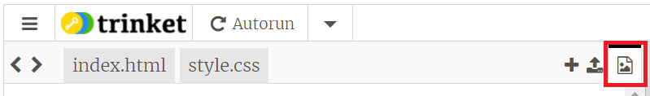
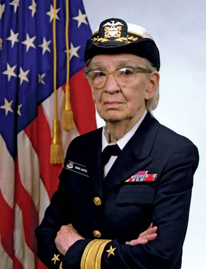
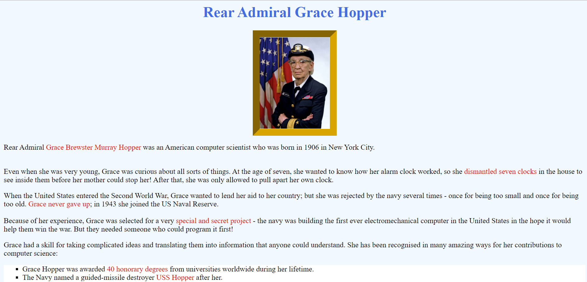

## Adding Lists and Images 

Make your website look more interesting with lists and images.

Lists are useful for grouping related information together and displaying it in a way that is easy to understand. Lists can be unordered like bullet points or ordered using numbers or letters.

--- task ---

Find some information for your Computer Scientist that could be displayed in a list. 
**Choose:** will your facts be unordered or ordered?

--- /task ---

The tags for unordered lists are ```<ul>``` and ```</ul>``` and the tags for ordered lists are ```<ol>``` and ```</ol>```.

Items in a list are written in ```<li>``` and ```</li>``` list tags.

```html
<p>Here is an unordered list</p>
<ul>
<li>banana</li>
<li>apple</li>
<li>carrot</li>
</ul>
```

```html
<p>Here is an ordered list</p>
<ol>
<li>banana</li>
<li>apple</li>
<li>carrot</li>
</ol>
```

--- task ---

Update the list information in the website code. Introduce your list with a short paragraph ```<p>``` 

Decide to keep the ```<ul> </ul>``` tags for an unordered list or change them to ```<ol> </ol>``` for an ordered list.

Change the information in the ```<li></li>``` list items to show information on your Computer Scientist. In the example we wrote:

--- code ---

---
language: html
filename: index.html
line_numbers: true
line_number_start: 
line_highlights: 2-7
---
```
<p> Grace had a skill for taking complicated ideas and translating them into information that anyone could understand. She has been recognised in many amazing ways for her contributions to computer science:</p>
    <ul>
        <li>Grace Hopper was awarded <span>40 honorary degrees</span> from universities worldwide
during her lifetime.</li>         
        <li>The Navy named a guided-missile destroyer <span>USS Hopper</span> after her.</li>
        <li>Google in 2020 named its new undersea network cable 'Grace Hopper', the cable
will connect the US, UK and Spain!</li>
        <li> Her legacy was an inspiring factor in the creation of the <span>Grace Hopper
Celebration of Women in Computing</span>. Held yearly, this conference is designed to
bring the research and career interests of women in computing to the forefront.</li>
    </ul>
```    
--- /code ---

--- /task ---

The `````` tag is used to add images to a webpage. Images are not actually added to the webpage, the `````` tag has a link to where the image is stored. 

The `````` tag does not have an ```</img>``` end tag. Instead we write the `````` tag like this: 

``````

There are two attributes in the `````` tag. These are src and alt:
src = the place the image is stored
alt = the text that is shown if the image cannot be displayed 

<p style="border-left: solid; border-width:10px; border-color: #0faeb0; background-color: aliceblue; padding: 10px;">The first web page went live on August 6th 1991. It looked a lot like your website does at the moment with a heading, paragraphs, and a list of information. Images were not added to websites until a year later. </p>

--- task ---

**Choose:** Pick an image to add to your website.

**If working in Trinket:** Images of all the listed Computer Scientists are included in the Trinket image gallery for the starter project. You can see the filenames by clicking the gallery icon at the top right of the workspace:


**If working offline:** Images of all the listed Computer Scientists are stored in the images folder included with the starter project. You can see the filenames by using your file manager to navigate to the correct folder on your computer. 

--- /task ---

--- task ---

Go to your website code and delete the text ```rpilogo.png``` on line 32.

**If working in Trinket:** Replace this text with the filename of your chosen image, making sure to use the correct **extension** for the file! (The letters after the dot.)
```html

``` 

**If working offline:** Replace this text with the filename **and relative path** of your chosen image, making sure to use the correct **extension** for the file! (The letters after the dot.)

```html

``` 

--- /task ---

--- task ---

Update the **alt** text to describe the image:
```html

```
--- /task ---

--- task ---

Add  ```width``` and ```height``` attributes to resize your image: 

**Try:**  experiment with different numbers until the image is the size you want:

```html

```
--- /task ---

--- task ---

Edit the remaining paragraphs and headings. Add more lists and images to your website until you are happy with it:


--- /task ---

In the next step, we're going to look at the CSS stylesheet to make your website more exciting and colourful!

--- save ---
