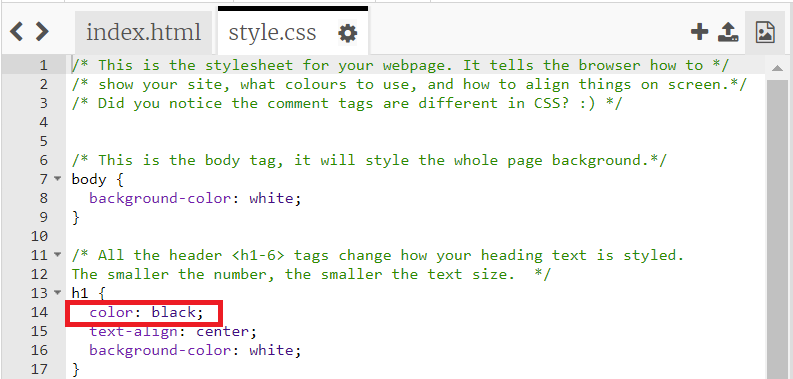
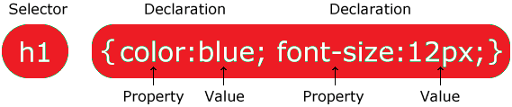
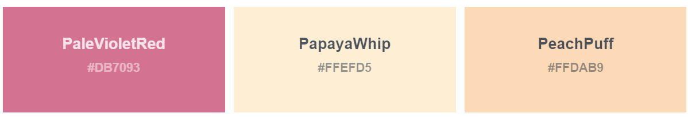

## Making it Colourful

Use CSS to change colours, fonts and other graphical effects. In this step, you're going to edit the included CSS stylesheet, called ```style.css```.

If HTML tells the browser how to set out the structure of the website and **what** you should see, CSS tells the browser **how it should look** when it comes to colours, sizes and other artistic choices. 

You used HTML to set out the structure of your website and display information. Now you will use CSS to tell the browser how it should look.

CSS rules are stored in stylesheets that are used by the webpages. This means you can:
+ quickly amend the stylesheet to change one rule across all the webpages that use it.
+ add more stylesheets to change the whole appearance of your website. 

--- task ---
Click on ```style.css```. On lines 13 - 17 you will find the CSS for the ```<h1>``` heading tag. 

Change ```color: black``` to ```color: green```:


--- /task ---

Every **rule** in CSS is made up of two parts: the **selector** and the **declaration**.

The **selector** links to the HTML element you want to style. In this example, it's any first level header: h1

The **declaration** contains instructions on how to style it. Each declaration is separated by a semi-colon.


This CSS Rule will mean information in the ```<h1>``` element will be coloured blue and the font size will be 12px.   

--- task ---
Find Selectors for your paragraphs, span, lists and images.

You can switch between your ```index.html``` and ```style.css``` files to compare.

--- /task ---

One of the main things CSS is used for when formatting websites is adding splashes of colour to different elements. Using the rules in your CSS stylesheet, you can change the colours which are applied to each different element, just by writing the name of the colour you want in the declaration.

[This list](https://www.w3schools.com/cssref/css_colors.asp){:target="_blank"} shows the colours you can use in your website. When you add colours to your stylesheet, you can use either the **colour name** or the **hex code** to define what colour you want.  



--- task ---
Pick a colour from the list to use as your website background. 

Go to the ```body``` selector and find the ```background-color``` attribute in the declaration. 

Change the colour to your chosen colour.  Remember to include the capital letters in the right places!

--- /task ---

--- task ---
You can also change the ```color``` and ```background-color``` of the text in the headings, paragraph, list and span tags. 

**Choose:** Add your chosen body ```background-color``` to the other selectors or pick new colours from the list. 

Change all the colours in your ```style.css``` file until you are happy with the way your website looks. 

--- /task ---

--- task ---
Text can be horizontally aligned to the ```left``` , ```center``` or ```right``` . Experiment with the ```text-align``` attribute in the header and paragraph selectors to position the text on the page.

--- /task ---

--- save ---
