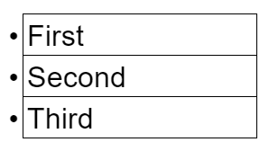
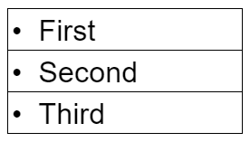

## Using More Style

Using CSS you can easily set the styling rules for your ordered ```<ol>``` and unordered ```<ul>``` lists, including the way the list markers (bullets, numbers or letters) are formatted. You can even use an image as your bullets if you like!

--- task ---
Find the ```ul``` and ```ol``` rules in your stylesheet. (They're near the bottom.) You should see a declaration for ```list-style-type```. 

--- /task ---

The options available to you in ```list-style-type``` are:

Unordered:
+ disc
+ circle
+ square

Ordered:
+ decimal
+ decimal-leading-zero
+ lower-roman
+ upper-roman
+ lower-greek
+ lower-latin
+ upper-latin
+ armenian
+ georgian
+ lower-alpha
+ upper-alpha

Both:
+ none

--- task ---
Change the ```list-style-type``` declaration for your list now and see what each of them do. Pick one you like and keep it.
--- /task ---

The next declaration in your stylesheet under the list rules is ```list-style-position```. 

```list-style-position: outside;``` means that the bullet points will be outside the list item. The start of each line of a list item will be aligned vertically. 

This is the default setting (it is what will be chosen if you leave it empty):


```list-style-position: inside;``` means that the bullet points will be inside the list item. As it is part of the list item, it will be part of the text and push the text across to make room at the start:


--- task ---
Have a look at the difference between ```inside``` and ```outside``` list position on your website by changing this declaration and pick the one you like. 
--- /task ---

### CSS Images

CSS also allows us to create rules for styling images, including their size, border thickness and colour, rounded or sharp corners and the distance from our image to other elements, called **padding**.

Let's start by changing the border around your image. 

--- task ---
Find the ```border``` declaration under the ```img``` rule at the very bottom of your stylesheet. You will notice it currently has some values included.  

The first value sets how **thick** the border will display. It is set to 1 pixel (px) for now, but you can change that number to whatever you like!

--- /task ---

The next value in our border declaration currently says ```solid```, and denotes the kind of line your border will display. You have a few options for your border line, including:

+ dotted - Defines a dotted border
+ dashed - Defines a dashed border
+ solid - Defines a solid border
+ double - Defines a double border
+ groove - Defines a 3D grooved border. The effect depends on the border-color value
+ ridge - Defines a 3D ridged border. The effect depends on the border-color value
+ inset - Defines a 3D inset border. The effect depends on the border-color value
+ outset - Defines a 3D outset border. The effect depends on the border-color value
+ none - Defines no border
+ hidden - Defines a hidden border

--- task ---
Change the word ```solid``` in your border declaration and see what sort of borders you can use.
--- /task ---

--- task ---
The final value in our ```border``` declaration is an easy one - colour. Simply change the word ```black``` to any of the colour names you have found in [this list](https://www.w3schools.com/cssref/css_colors.asp).
--- /task ---

Once you have created a border you like, we can use the next declaration to make the corners smoother and rounded rather than sharp and square using the ```border-radius``` declaration. This delcaration determines how big a circle you want to use for the corners - the bigger the number, the rounder the corners!

--- task ---
Have a play with the number in the ```border-radius``` declaration until it looks the way you want. (Leaving the declaration blank will give sharp, square corners.)
--- /task ---

The next declaration is ```padding```, which tells the browser how much empty space to place around your image (inside the border). The bigger the number, the larger the gap between the image and the border. 

--- task ---
Decide upon how large a ```buffer``` you would like around your image by changing the number in the declaration.
--- /task ---

Our final declaration can be used to set a uniform size for an image. The number under the ```width``` declaration determines how wide your image will display. It doesn't matter how big the original image is, you can resize it quickly and easily using CSS. 

You can set the image width in two ways: 

You can define the width as a certain number of pixels by using a numerical value followed by ```px```, like this: ```150px```.  This declaration will set the width of the image to 150 pixels across, and resize the height of the image to keep it looking the same. 

You can also set the width of the image by using a percentage (50%, 37%, 200%, or any number). This will also resize the image in all dimensions.

--- task ---
Change the ```width``` declaration for your image until it is the size you would like.
--- /task --- 

--- save ---