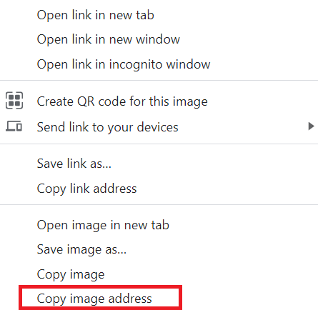

## Upgrade your project

Now that you know how to use the main elements of HTML and CSS, what else can you add to your webpage to make it even cooler?

Try using the `````` element to add more pictures you find on the internet!

--- collapse ---
---
title: Adding an image from the internet
---

To add an image from the internet to your website you need to find the image address (place it is stored). 

Right click on your chosen image and select **Copy image address**:


Right-click and ‘Paste’ your image address into the **src** attribute in the `````` tag. Update your alt-text to fit the image.
Your code will look something like this:    
```html

```

--- /collapse ---

--- save ---